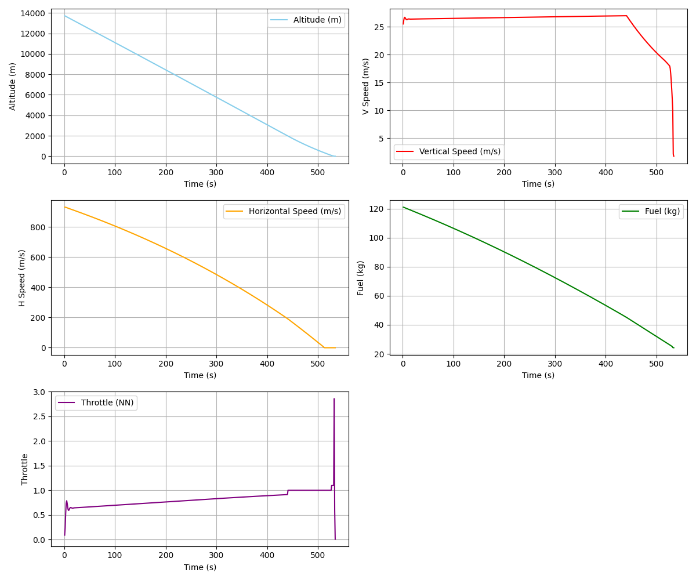

# Space Engineering Task 1:
# 🌓 Bereshit Moon Landing Simulation
## Submitted by: Yevgeny Ivanov 324780246, Koren Abdush 209271535

This repository simulates the descent and landing of the **Beresheet Lunar Module**, using physical models and flight control strategies aimed at improving upon the real mission's outcome. The simulation demonstrates a successful landing with optimized fuel usage and precise descent control.

## 📁 Repository Structure

- **`Bereshit.py`**  
  Contains the main simulation logic for the Beresit lunar module's descent. It calculates physics-based dynamics such as altitude, speed, and fuel consumption, and implements control logic for a safe landing.

- **`Moon.py`**  
  Provides environmental constants and parameters for the Moon’s gravity and surface conditions. It is used in conjunction with `Bereshit.py` to simulate realistic lunar descent physics.

- **`BereshitOverview.pdf`**  
  A comprehensive overview and technical analysis of the real Beresheet mission, including reasons behind the original mission failure (notably, the disconnection of the Inertial Measurement Unit - IMU).

## 📊 Results

The simulation, visualized in the figure below, demonstrates:

- A smooth descent profile with gradually decreasing **altitude**.
- Controlled **vertical** and **horizontal** velocities.
- Efficient **fuel** usage throughout the descent.
- Smart **throttle** control ensuring stability near the surface.

The simulation shows a final touchdown with safe speeds and approximately **20 kg of fuel remaining**, demonstrating that the mission could have succeeded under adjusted conditions.

## ✅ Conclusion

The primary cause of the original Beresheet crash was the deactivation of the Inertial Measurement Unit (IMU), which resulted in the lander's main engine shutting down prematurely. In this simulation, we maintain IMU operation throughout the descent, allowing full control to be retained during all flight phases.

While the original mission aimed to land with about **50 liters of fuel**, our simulated descent achieved a successful landing with **~20 kg of fuel remaining**. This highlights that even with a lower fuel reserve, a controlled and safe landing was achievable — **if only the IMU had not been turned off**.

